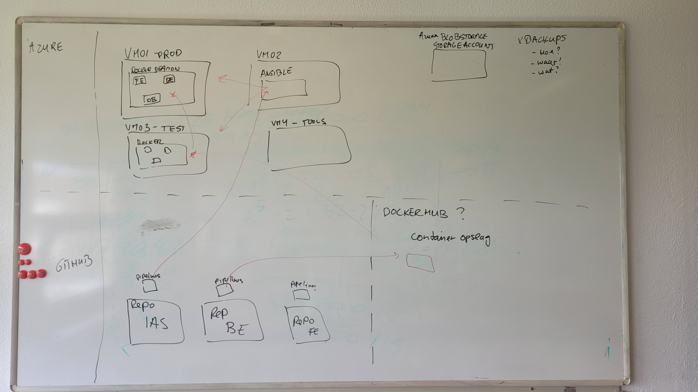
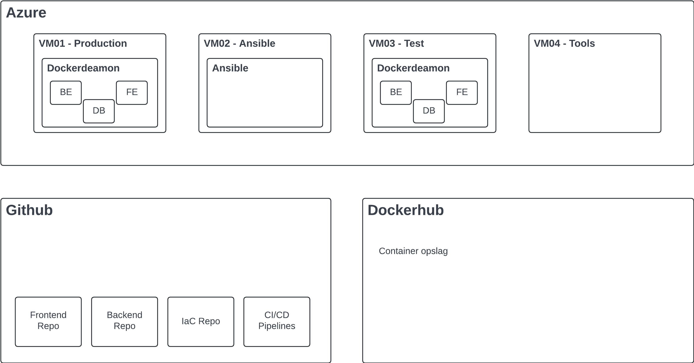

  <nav style="display:flex; gap:15px; height:30px;">
    <a markdown="1" style="text-decoration:none; color:#333; font-weight:bold;">[Installation Guides](../installation_guides/prerequisites.md)</a>
    <a markdown="1" style="text-decoration:none; color:#333; font-weight:bold;">[Meetings](../meetings/iteratie_1.md)</a>
    <a markdown="1" style="text-decoration:none; color:#333; font-weight:bold;">[Onderzoek](../onderzoek/main_onderzoek.md)</a>
    <a markdown="1" style="text-decoration:none; color:#333; font-weight:bold;">[Retrospectives](../retrospectives/home_retrospectives.md)</a>
  </nav>

---

<nav style="display:flex; gap:15px; height:30px;">
  <a markdown="1" style="text-decoration:none; color:#333; font-weight:bold;">[Iteratie 1](iteratie_1.md)</a>
  <a markdown="1" style="text-decoration:none; color:#333; font-weight:bold;">[Iteratie 2](iteratie_2.md)</a>
  <a markdown="1" style="text-decoration:none; color:#333; font-weight:bold;">[Iteratie 3](iteratie_3.md)</a>
  <a markdown="1" style="text-decoration:none; color:#333; font-weight:bold;">Iteratie 4</a>
  <a markdown="1" style="text-decoration:none; color:#333; font-weight:bold;">[Iteratie 5](iteratie_5.md)</a>
  <a markdown="1" style="text-decoration:none; color:#333; font-weight:bold;">[Iteratie 6](iteratie_6.md)</a>
  <a markdown="1" style="text-decoration:none; color:#333; font-weight:bold;">[Iteratie 7](iteratie_7.md)</a>
  <a markdown="1" style="text-decoration:none; color:#333; font-weight:bold;">[Iteratie 8](iteratie_8.md)</a>
  <a markdown="1" style="text-decoration:none; color:#333; font-weight:bold;">[Iteratie 9](iteratie_9.md)</a>
</nav>

---

# Iteratie 4

2 bestuurders Git --> Cas & Levi 

## Architectuur plaatje 
<!-- 
 -->

(Credit naar Levi voor de 2e afbeelding)

Waarom test en productieomgeving/ VM apart?

-	Aparte data voor productie en testen

## Berichten naar Slack 

-	1 channel voor alle push-notificaties 
-	Welke berichten wordt later besproken

## Wat zijn we aan het doen? 

### Mee bezig:

-	Code linther
-	Unit tests
-	Telemetry  online check (naar Slack)
-	Ansible
-	Maken VM via CLI
-	Code coverage
-	Feedback pipeline van Github push/ testmeldingen naar Slack
-	Feedback pipeline van Github Takenbord naar Slack
-	Container Frontend

### To do:

-	Backups onderzoeken
-	Docker op VM zetten
-	Containers op docker op VM zetten
-	Containers op docker op VM publiceren online via www….
-	Onderzoeken container registry 
-	Pipeline container backend maken
-	Pipeline container database maken 
-	Testen(welke testen, hoe wordt getest, automatisch?)
-	Hoe gaan we van test naar productie? 
-	Documentatie/ communicatie eindgebruiker 
o	Gebruikersdocumentatie?
o	Notificaties naar eindgebruikers? 
o	Release notes? 

## Requirements/ user stories 

-	Wordt doorgeschoven naar maandag week 5

---